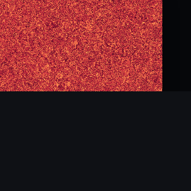

# Wallpaper Generator

A catalog of **120 abstract-wallpaper generators** running in the browser. Vanilla JS, no dependencies, no build step. Canvas 2D, real time, PNG + WebM export, sharing via URL parameters.



## What's inside

**120 styles** across **7 categories**:

- **Flow** (2) — particles in vector fields, emergent flocking.
- **Noise** (8) — fBM, domain warp, nebulae, sand, low-poly terrain.
- **Geometry** (33) — parametric curves, tessellations, symmetries, knots, Penrose tiling, moiré, Apollonian circles.
- **Algorithms** (30) — fractals, L-systems, attractors, chains, graphs, cellular automata.
- **Dots** (11) — Fibonacci, stippling, runes, pollen, blue noise.
- **Textures** (17) — marble, wood, fabric, hatching, chainmail.
- **Organic** (19) — fire, water, lava, lightning, smoke.

12 curated palettes, a static/animated mode switch (19 of 120 styles support live animation — the rest are static patterns by design, and the toggle is disabled for them), WebM recording.

## Style catalog

### Flow

- **Curl Flow** (`id=curlflow`) — Particles in a divergence-free field — real vortices, no clumping.
- **Boids Flocking** (`id=boids`) — Separation, alignment, cohesion — flock trails that emerge, not a field they follow.

### Noise

- **Domain Warp** (`id=domainwarp`) — Noise warped by other noise — currents and inception-like patterns.
- **Topographic** (`id=topography`) — Contour lines over a noise field — a topographic relief map.
- **Log-Polar Spiral** (`id=logpolar`) — Noise unrolled into log-polar coordinates — galaxies and whirlpools.
- **Billow Noise** (`id=billow`) — "Puffy" fBM built from |noise| — clouds, cotton wool.
- **Ridged Multifractal** (`id=ridged`) — "Mountain ridges": 1 - |noise| across octaves.
- **Nebula** (`id=nebula`) — Nebula: fBM clouds plus point stars of varying brightness.
- **Gradient Mesh** (`id=gradient_mesh`) — Mesh gradient: overlapping radial gradients at random points.
- **Sand Dunes** (`id=sandhills`) — Sand dunes: a silhouette built from noise layers.
- **Low-Poly Terrain** (`id=lowpoly`) — A flat-shaded triangle mesh over noise terrain — faceted, hypsometric.

### Geometry

- **Voronoi Cells** (`id=voronoi`) — Worley cell diagrams — cracks, coral, cracked glass.
- **Truchet Tiles** (`id=truchet`) — Random curved arcs on a grid — an Escher-style tiling.
- **Spirograph** (`id=spirograph`) — Hypotrochoids — mathematical curves, the classic spirograph toy.
- **Concentric Rings** (`id=concentric`) — Concentric rings warped by noise — a tunnel effect.
- **Hex Grid** (`id=hexgrid`) — Hexagonal honeycomb with noise-offset centers and fills.
- **Barcode** (`id=barcode`) — Barcode: random bars of varying width.
- **Brick Wall** (`id=brick`) — Brick wall with noise-driven variation per brick.
- **Lissajous** (`id=lissajous`) — Lissajous curves — parametric figures from two sine waves.
- **Polar Rose** (`id=polarrose`) — Polar rose: r = cos(k·θ), parametric petals.
- **Archimedean Spiral** (`id=archimedes`) — Archimedean spiral r = a + b·θ with several arms.
- **Clover Grid** (`id=clover`) — A grid of 4 interlocked circles (square clover).
- **Hyperbolic Tessellation** (`id=tessellation`) — Hyperbolic tessellation in the Poincaré disk.
- **Celtic Knot** (`id=celtic`) — Celtic knot: interwoven bands around circles.
- **Triangulation** (`id=triangles`) — Triangulation of random points with colored triangles.
- **Diamond Grid** (`id=diamonds`) — A diamond grid with noise-driven variation.
- **Compass Rose** (`id=compass`) — Compass rose: N arrows, rings and tick marks.
- **Spring** (`id=spring`) — Spring: a sinusoidal ribbon between two points.
- **Gears** (`id=gears`) — Interlocking toothed gears.
- **Shards** (`id=shards`) — Shards: random sharp-angled polygons.
- **Azulejo** (`id=azulejo`) — Azulejo: square tiles with a cross-shaped motif at the center.
- **Neon** (`id=neon`) — Neon: curved lines with a strong glow.
- **Curved Stripes** (`id=stripes_curved`) — Curved stripes following a noise topology.
- **Diagonal Stripes** (`id=stripesdiag`) — Diagonal stripes with noise-based offset.
- **Waves Grid** (`id=waves_grid`) — Sine waves along two axes.
- **Rings Stack** (`id=rings3`) — A stack of thick rings of varying size.
- **Strings** (`id=strings`) — Strings: threads between posts, sagging under gravity.
- **Squiggles** (`id=squiggles`) — Random squiggles made of Bézier curves.
- **Penrose Tiling** (`id=penrose`) — Aperiodic rhombus tiling by deflation — never repeats, no matter how far it tiles.
- **Chladni Patterns** (`id=chladni`) — Nodal lines of a vibrating plate — sand settling where the surface stays still.
- **Girih Star Grid** (`id=girih`) — Interlocking star polygons on a grid, Islamic geometric strapwork style.
- **Moiré Interference** (`id=moire`) — Two overlaid grids beat against each other — pure line-density interference.
- **Apollonian Gasket** (`id=apollonian`) — Circles packed into circles packed into circles, forever — Descartes' theorem made visible.
- **String Art** (`id=stringart`) — Straight chords between numbered pins on a circle — envelope curves from pure geometry.
- **Superformula Motif** (`id=superformula`) — Gielis' one-equation shape family — stars, flowers, gears — tiled as a print motif.

### Algorithms

- **Reaction-Diffusion** (`id=reactiondiffusion`) — Gray-Scott: reagents A and B diffuse and react. Coral, mazes, mitosis.
- **Mandelbrot / Julia** (`id=mandelbrot`) — Escape-time fractal: classic Mandelbrot or a Julia variant.
- **L-System Trees** (`id=lsystem`) — Fractal trees via an L-system — turtle graphics.
- **Maze** (`id=maze`) — Recursive backtracker: a fresh maze every frame.
- **Hilbert Curve** (`id=hilbert`) — Recursive Hilbert space-filling curve.
- **Dragon Curve** (`id=dragon`) — The Harter–Heighway dragon curve.
- **Sierpinski Triangle** (`id=sierpinski`) — The recursive Sierpinski triangle fractal.
- **Frost** (`id=frost`) — Frost: branching crystals with 6-fold symmetry.
- **Julia Set** (`id=julia`) — Julia set for a complex quadratic map.
- **Newton Fractal** (`id=newton`) — The Newton fractal for z³ - 1 = 0: three basins of attraction.
- **Burning Ship** (`id=burning`) — Burning Ship: |Re|+|Im|, a distorted relative of the Mandelbrot set.
- **Metaballs** (`id=metaballs`) — Metaballs: marching squares over the isosurface of summed fields.
- **Fractal Tree** (`id=tree`) — Recursive fractal tree with adjustable branching.
- **Barnsley Fern** (`id=fern`) — Barnsley fern: IFS points from four affine transforms.
- **Wire Net** (`id=wire`) — A connected nearest-neighbor graph: edges + nodes.
- **Cantor Dust** (`id=cantor`) — Cantor dust: quadrant subdivision with a keep probability.
- **Chains** (`id=chains`) — Chains: linked elliptical rings.
- **Sorting Art** (`id=sorting`) — Sorting: each frame is a snapshot of an array mid-sort.
- **Circuit Board** (`id=circuit`) — Circuit board: orthogonal traces and chips.
- **Lorenz Attractor** (`id=lorenz`) — The Lorenz strange attractor, projected in 3D.
- **Flowsnake** (`id=flowsnake`) — Gosper curve (flowsnake) — an L-system fractal.
- **Flowsnake 2** (`id=flowsnake2`) — Peano-Gosper curve, colored by recursion depth.
- **Branches** (`id=branches`) — Branches with leaves: recursive forking.
- **Net Graph** (`id=netgraph`) — Network graph: random nodes, edges highlighted by degree.
- **Messy Hair** (`id=messyhair`) — Tangle: random Bézier curves between points.
- **Game of Life** (`id=gameoflife`) — Conway's Game of Life: a random soup evolved forward, frozen mid-run.
- **Elementary CA** (`id=elementaryca`) — Wolfram's 1D cellular automaton (Rule 30 and friends), rows stacked into a field.
- **Diffusion-Limited Aggregation** (`id=dla`) — DLA: random walkers freeze onto a growing cluster — coral, lichen, frost.
- **Langton's Ant** (`id=langtonsant`) — A single ant flipping cells by a two-rule law — chaos, then a highway.
- **Clifford Attractor** (`id=cliffordattractor`) — A million-point density cloud from a simple iterated map — smoky, not linear like Lorenz.

### Dots

- **Stippling** (`id=stippling`) — Thousands of dots whose density follows a noise field.
- **Phyllotaxis** (`id=phyllotaxis`) — A Fibonacci spiral by the golden angle — sunflower / pine cone.
- **Glyphs** (`id=glyphs`) — A grid of assorted glyphs and symbols.
- **Pulse** (`id=pulse`) — Random centers with expanding ring waves.
- **Scatter** (`id=scatter`) — Dots scattered according to noise density.
- **Sparkling Stars** (`id=stars`) — Stars with rays: random size, brightness and orientation.
- **Orbital Trails** (`id=orbital`) — Orbital trails: particle trails flying along smooth loops.
- **Dot Grid** (`id=dotgrid`) — A dot grid with brightness driven by noise.
- **Pollen** (`id=pollen`) — Pollen: rings of dots around centers.
- **Runic** (`id=runic`) — Arcane runes: Unicode glyphs on "parchment".
- **Blue-Noise Stippling** (`id=bluenoise`) — Poisson-disk sampled dots — evenly spaced, no clumps, no gaps.

### Textures

- **Halftone** (`id=halftone`) — A halftone dot grid, newspaper-print style.
- **Cracked Earth** (`id=cracked`) — Cracked earth — Voronoi cells filled in earthy tones, with cracks.
- **Weave** (`id=weave`) — Interwoven horizontal and vertical threads.
- **Plaid** (`id=plaid`) — Tartan plaid: bands of varying width, crossing.
- **Portholes** (`id=porthole`) — A grid of portholes: concentric circles with a highlight.
- **Mosaic** (`id=mosaic`) — Mosaic: Voronoi cells with noisy edges, palette per tile.
- **Stained Glass** (`id=stainedglass`) — Stained glass: Voronoi cells with a thick dark outline.
- **Wood** (`id=wood`) — Wood: grain from warped noise.
- **Marble** (`id=marble`) — Marble: sine-wave bands warped by noise.
- **Rock** (`id=rock`) — Rock: uneven chunks with noise-driven cracks.
- **Bubblewrap** (`id=bubblewrap`) — Bubble wrap: a hex grid of bubbles with gradients.
- **Hatching** (`id=hatching`) — Hatching: parallel lines with noise-driven density.
- **Sand** (`id=sand`) — Sand: fine grain with noise regions of varying brightness.
- **Bars** (`id=bars`) — Horizontal bars of random thickness.
- **Spectrum** (`id=spectrum`) — Spectrum: bars of varying height driven by noise.
- **Honeycomb 3D** (`id=honeycomb3d`) — Pseudo-3D honeycomb: each hexagon shaded with a gradient and shadow.
- **Chainmail** (`id=chainmail`) — Chainmail: rings in a checkerboard layout with gradients.

### Organic

- **Caustics** (`id=caustics`) — A sum of traveling waves — underwater light rays.
- **Asemic Writing** (`id=asemic`) — Generative calligraphy — flowing, unreadable strokes.
- **Inkblot** (`id=inkblot`) — Symmetric inkblots (Rorschach test).
- **Waves** (`id=waves`) — Sine waves along two axes.
- **Water** (`id=water`) — Water surface: Perlin noise + sine waves with a specular highlight.
- **Fire** (`id=fire`) — Fire: rising noise columns with a color gradient.
- **Kaleidoscope** (`id=kaleidoscope`) — Kaleidoscope: N symmetric sectors filled with noise.
- **Lightning** (`id=lightning`) — Lightning: branching discharges from the top edge.
- **Cloud Puff** (`id=cloudpuff`) — Volumetric clouds: two-tier brightening via noise.
- **Ripples** (`id=ripples`) — Ripples on water: overlapping wave fronts.
- **Vortex** (`id=vortex`) — Vortex: a spiral pulling trajectories toward the center.
- **Tentacles** (`id=tentacles`) — Tentacles: random Bézier curves tapering in width.
- **Wave Field** (`id=wave_field`) — Wave field: top and bottom edges from two different sine waves.
- **Echo Rings** (`id=echo`) — Echo: a source curve and its fading copies, rotated around a circle.
- **Lava** (`id=lava`) — Lava: cracks in the dark with glowing edges.
- **Bubbles** (`id=bubbles`) — Bubbles with overlaps and realistic highlights.
- **Calligraphy** (`id=calligraphy`) — Calligraphic flourishes with variable stroke width.

## Palettes

12 curated palettes are available in the side panel: `lava`, `aurora`, `sunset`, `ink`, `ocean`, `botanic`, `bubblegum`, `desert`, `cyber`, `pastel`, `sapphire`, `coral`. Each is a linear interpolation across 5 anchor colors from 0 to 1, also used for the background where needed.

## Running it

```bash
cd wallpaper-generator
python3 -m http.server 8765
# open http://localhost:8765/
```

Any static file server works (`npx serve .`, `npx http-server`, `php -S`).

## URL parameters

```
?style=curlflow|domainwarp|topography|logpolar|billow|ridged|nebula|gradient_mesh|
       sandhills|voronoi|truchet|spirograph|concentric|hexgrid|barcode|brick|
       lissajous|polarrose|archimedes|clover|tessellation|celtic|triangles|diamonds|
       compass|spring|gears|shards|azulejo|neon|stripes_curved|stripesdiag|
       waves_grid|rings3|strings|reactiondiffusion|mandelbrot|lsystem|maze|hilbert|
       dragon|sierpinski|frost|julia|newton|burning|metaballs|tree|
       fern|wire|cantor|chains|sorting|circuit|lorenz|flowsnake|
       flowsnake2|branches|netgraph|messyhair|stippling|phyllotaxis|glyphs|pulse|
       scatter|stars|orbital|dotgrid|pollen|runic|halftone|cracked|
       weave|plaid|porthole|mosaic|stainedglass|wood|marble|rock|
       bubblewrap|hatching|sand|bars|spectrum|honeycomb3d|chainmail|caustics|
       asemic|inkblot|waves|water|fire|kaleidoscope|lightning|cloudpuff|
       ripples|squiggles|vortex|tentacles|wave_field|echo|lava|bubbles|
       calligraphy|gameoflife|elementaryca|dla|langtonsant|penrose|chladni|
       girih|moire|lowpoly|bluenoise|apollonian|cliffordattractor|stringart|
       superformula|boids
&palette=lava|aurora|sunset|ink|ocean|botanic|bubblegum|desert|cyber|pastel|sapphire|coral
&seed=42
&resolution=1920x1080|2560x1440|3840x2160|1080x1920|1280x720
&mode=static|animated
&lite=1   # hide the UI, give the whole screen to the wallpaper
```

Examples:

```
http://localhost:8765/?style=domainwarp&palette=aurora&seed=42&lite=1
http://localhost:8765/?style=lsystem&seed=7&lite=1
http://localhost:8765/?style=julia&palette=cyber&seed=99&lite=1
```

## Stack

- Plain ES Modules, no bundler.
- Canvas 2D for all rendering.
- A custom 2D Simplex noise implementation (public domain, after Stefan Gustavson).
- Mulberry32 for deterministic seeding.
- FNV-1a hashing to derive per-style child seeds.
- `MediaRecorder` + `canvas.captureStream` for WebM recording.
- A Web Worker for Reaction-Diffusion (the heavy warmup doesn't block the UI).

## Structure

```
.
├── index.html                # panel + canvas + overlay + toast
├── styles.css                # UI + spinner
├── docs/                     # preview screenshots
└── js/
    ├── app.js                # orchestrator, UI, loader
    ├── noise.js              # Simplex + fBM/ridge
    ├── rng.js                # Mulberry32, helpers
    ├── palettes.js            # 12 palettes + color interpolation
    ├── utils.js               # resizeCanvas, canvas download
    ├── styles.js              # the registry of 120 styles, grouped by category
    └── styles/                # one file per style + rd-worker.js
```

## Adding your own style

1. Create `js/styles/mystyle.js` and export an object:

```js
export const mystyle = {
  id: "mystyle",
  name: "My Style",
  category: "Geometry",   // lands in the matching UI section
  blurb: "Short description.",
  defaults: { /* param values */ },
  params: [
    { key: "density", label: "Density", min: 0.0001, max: 0.001, step: 0.00002 },
    { key: "shape",   label: "Shape",   enum: ["circle", "line"] },
  ],
  createState(opts, w, h) {
    // Return a cache that survives animation.
    return { /* ... */ };
  },
  paint(ctx, opts, state) {
    // Render one frame.
  },
  animate?(ctx, opts, state, t) {
    // Optional. t is milliseconds since animation start.
  },
};
```

2. Register it in `js/styles.js`:

```js
import { mystyle } from "./styles/mystyle.js";
export const STYLES = [/* ..., */ mystyle];
```

3. Done — the style shows up under its category in the UI. The search box at the top helps find it by name.

## Performance notes

### Render architecture

In `js/app.js`:

- `scheduleRender({heavy})` is the single entry point.
  - **`heavy: true`** (style/palette/seed/resolution change) — shows a full-screen overlay with a spinner.
  - Without `heavy` (slider drag, select change) — renders on the next RAF with no overlay, no UI flicker.
- `renderBusy` / `renderToken` — while `style.paint` is running, new requests don't kick off a second render right away. Once the current render finishes, `renderPending` is checked and, if new params arrived, another RAF is scheduled.
- Optional **`paintChunked(ctx, opts, state)`** — an async variant for heavy styles. Between chunks it calls `opts._yield` (rAF by default), so the main thread never blocks and the browser keeps handling clicks, hover, etc. Enabled for **Cloud Puff** (the slowest style, 1.4s/frame at 1280×720).

### Profile at 1280×720 (sync paint)

| Style | Paint, ms |
|---|---|
| Cloud Puff | **~1400** (chunked, but the UI stays responsive) |
| Kaleidoscope | ~990 |
| Ridged | ~930 |
| Billow | ~930 |
| Concentric | ~910 |
| Wood | ~815 |
| Chladni | ~700 |
| Marble | ~625 |
| Water | ~565 |
| Domain Warp / Topography | 200–500 |
| Julia / Mandelbrot / Newton | 130–155 |
| Simple geometries (Voronoi, Truchet, Spirograph, Phyllotaxis, …) | <50 |

27 of 120 styles render in over 100ms. The rest are effectively instant.

### UI responsiveness

- **Slider drag**: before the fix, the overlay flashed on every input event (50 events → 50 spinner flashes). After the fix — **zero overlay flashes** while dragging; the render is scheduled via RAF with no overlay.
- **Style switch**: the overlay shows twice (show + hide) — correct for a heavy switch.
- **Chunked paint (Cloud Puff)**: other styles/the panel stay responsive during a long render; once the current chunked paint finishes, an RAF is scheduled for a new render with the updated params.

### Heavy styles

- **Curl Flow** — most of the work goes into integrating trajectories. At 4K with the default density: 1–3s.
- **Domain Warp / Topography / Log-Polar** — per-pixel fBM; `sampleStep` is available for downsampling.
- **Reaction-Diffusion** — the heaviest. A 4000-step warmup runs in a Web Worker. `simResolution` and `stepsPerFrame` control quality. Under `?lite=1` the Worker is disabled and warmup runs sync.
- **Grid-indexed field arrays (RD, Voronoi)** — fast.
- **Barnsley Fern, hash-based styles** (Cantor, Branches) — take a fraction of a second even at 4K.
- **`createImageData`-based images** (Mandelbrot, Julia, Newton, Burning, Wood, Marble, Nebula, Fire, Water, Lorenz) — roughly 50–500ms at 1920×1080, depending on iteration count.
- **At 4K**, some fractals can take a few seconds. Use `?lite=1` or lower `maxIter`.

## Mobile version (bottom-sheet drawer pattern)

On screens narrower than 820px the UI becomes a **bottom-sheet drawer**:

- **Default state**: only a thin drag handle is visible at the bottom, plus a floating round burger button (bottom-right, portrait only); the rest of the screen is the canvas (a full-screen wallpaper preview).
- **Tap the burger button, or the handle**: the drawer expands to 84vh, showing all the settings.
- **Swipe up on the handle**: opens it too.
- **Tap the canvas** while the drawer is open: closes it.
- **Tap × in the drawer's corner**: closes it.
- **Horizontal chip scroll** for the 120 styles (instead of a long vertical list); the selected chip also shows its description.
- **Tap targets ≥44px** for every button/field.
- `?lite=1` is available for sharing a finished wallpaper (hides the panel entirely).

Technically: `#panel` is `position: fixed; bottom: 0; height: 64px; max-height: 84vh` with an `is-open` toggle class; the canvas stretches to 100% via CSS `align-items: stretch; justify-content: stretch` on `#stage`.

`?lite=1` turns on "wallpaper mode": the canvas gets the full width/height, the panel is hidden.

For **Reaction-Diffusion** under `?lite=1` the Worker is disabled (sync warmup) — a Worker doesn't reliably get CPU time under headless screenshot tools.

## Algorithm references

- Curl noise: [Bridson 2007](https://www.cs.ubc.ca/~rbridson/docs/bridson-siggraph2007-curlnoise.pdf).
- Domain warping: [Inigo Quilez](https://iquilezles.org/articles/warp/).
- Reaction-Diffusion: [Robert Munafo's catalog](http://mrob.com/pub/comp/xmorphia/) — feed/kill presets.
- Voronoi / Worley noise: the original [Steven Worley paper, 1996](https://www.worley.com.au/worley/papers.html).
- Truchet tiles: the classic idea from [Sébastien Truchet (1704)](https://en.wikipedia.org/wiki/Truchet_tiles).
- Phyllotaxis / Fibonacci spiral: [Numberphile](https://www.youtube.com/watch?v=14-NdQw-uMQ).
- Caustics: the classic [ShaderToy caustic shader](https://www.shadertoy.com/view/MdlXz8).
- L-System: [Wikipedia](https://en.wikipedia.org/wiki/L-system), Lindenmayer 1968.
- Gosper / Flowsnake: [Wikipedia](https://en.wikipedia.org/wiki/Gosper_curve).
- Conway's Game of Life: [Wikipedia](https://en.wikipedia.org/wiki/Conway%27s_Game_of_Life), Gardner 1970.
- Elementary cellular automata: [Wolfram MathWorld](https://mathworld.wolfram.com/ElementaryCellularAutomaton.html).
- Diffusion-limited aggregation: [Witten & Sander, 1981](https://en.wikipedia.org/wiki/Diffusion-limited_aggregation).
- Langton's Ant: [Wikipedia](https://en.wikipedia.org/wiki/Langton%27s_ant), Langton 1986.
- Penrose tiling (kite/dart deflation): [Preshing's walkthrough](https://preshing.com/20110831/penrose-tiling-explained/).
- Chladni figures: [Wikipedia](https://en.wikipedia.org/wiki/Chladni_figure), Chladni 1787.
- Poisson-disk / blue-noise sampling: [Bridson 2007](https://www.cs.ubc.ca/~rbridson/docs/bridson-siggraph2007-poissondisk.pdf).
- Apollonian gasket / Descartes' Circle Theorem: [Wikipedia](https://en.wikipedia.org/wiki/Descartes%27_circle_theorem).
- Clifford / de Jong attractors: [Paul Bourke's collection](http://paulbourke.net/fractals/clifford/).
- Superformula: [Gielis 2003](https://en.wikipedia.org/wiki/Superformula).
- Boids: [Craig Reynolds, 1987](https://www.red3d.com/cwr/boids/).

## License

MIT.
